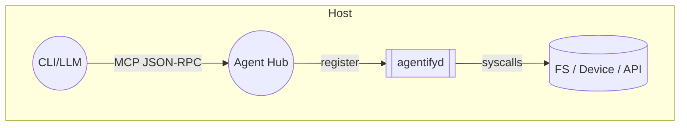
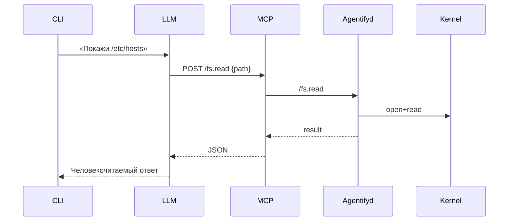

## Введение  
### **Контекст**  
Рост интереса к LLM‑ориентированным «операционным системам» и AI‑агентам усилил спрос на унифицированный способ обращения ко всем системным сущностям — от файлов до GPU и внешних REST API. Большинство решений сегодня требуют писателя кода-обёртки под каждую цель (FUSE‑драйверы, DBus‑сервисы, gRPC‑шлюзы). Это замедляет внедрение и плодит зоопарк интерфейсов.  

### **Проблема**  
DevOps‑ и ML‑команды тратят недели на создание прокси‑слоёв, повторно решая вопросы авторизации, логирования и горячего деплоя. Отсутствие стандарта затрудняет повторное использование агентов и ведёт к ошибкам безопасности.  

### **Определения и термины**  
| Термин | Определение |
|--------|-------------|
| **Agent** | Процесс/контейнер, предоставляющий стандартизированный контракт MCP & A2A. |
| **Passport (паспорт)** | YAML‑файл с декларацией методов, политик доступа и мэппинга на нативные вызовы. |
| **MCP** | Мини‑контрольный протокол JSON‑RPC поверх Unix‑socket/HTTP. |
| **A2A** | Agent‑to‑Agent потоковый gRPC‑протокол. |
| **agentifyd** | Демон, читающий Passport, генерирующий MCP эндпоинты и регистрирующий их в Hub. |
| **Hot Reload** | Перезагрузка паспорта и перерегистрация эндпоинтов без restarts. |

---

## Видение и цели продукта  
### **Главная цель**  
Сделать «оборачива­ние» любой системной сущности в агента задачей, решаемой за минуты декларативным YAML‑паспортом без написания кода.  

### **Подцели**  
1. Предоставить единый API‑слой (MCP/A2A) для вызова ресурсов.  
2. Обеспечить безопасное изолирование прав (seccomp, Linux capabilities).  
3. Добавить hot‑reload для паспортов без остановки службы.  
4. Поддержать x86‑64 / ARM / RISC‑V на Linux ≥ 5.10.  
5. Позволить LLM‑драйверам автоматически генерировать вызовы.  

### **Не‑цели**  
- Замена ядровых драйверов или FUSE.  
- Поддержка Windows/ macOS (план за пределами v1).  
- Графический UI‑редактор паспортов.  

---

## Анализ пользователей и рынка  
### **Персоны**

| Имя | Роль | Боль | Цель |
|-----|------|------|------|
| Света | ML‑инженер | Тратит дни на shell‑скрипты для чтения логов кластера | Получать данные через единый LLM‑интерфейс |
| Олег | DevOps SRE | Обновление облачных wrapper‑сервисов при каждом релизе ядра | Горячо подменять агенты без даунтайма |
| Мария | Платформенный архитектор | Пестрый ландшафт gRPC / REST / DBus | Стандартизировать IPC‑слой |
| Антон | Хоббист‑IoT | Ограниченные ресурсы, страх повредить root FS | Безопасно экспонировать GPIO как агент |
| Raj | Vendor‑ISV | Нужно быстро интегрировать GPU‑драйвер | YAML‑паспорт вместо 5 000 строк C++ |

### **Ключевые use‑cases**  
1. Чтение/запись файлов через LLM‑prompt.  
2. Запуск `journalctl -f` как стрим агента логов.  
3. HTTP‑запрос к внешнему URL с пост‑процессингом LLM.  
4. Обращение к GPU через `nvidia‑smi` wrapper.  
5. Инвентаризация подключённых USB‑устройств.  
6. Интеграция в Kubernetes‑Operator: под‑агенты как CRD.  

### **Конкурентный ландшафт**

| Решение | Плюсы | Минусы |
|---------|-------|--------|
| **FUSE‑Wrappers** | Mount‑driven UX | Только байтовой поток, нет семантики |
| **DBus‑Wrapper** | Нативен для Linux‑Desktop | Сложный XML, не cross‑platform |
| **OpenAPI Codegen** | Жёсткая типизация | Много boilerplate, нет hot reload |
| **Agentification Layer** | YAML‑декларации, hot‑reload, MCP/A2A | Требует рантайм‑демона |

---

## Обзор решения  
### Agentifyd + паспорт YAML + MCP + A2A Gateway  


### Поток данных end‑to‑end  
1. CLI/LLM посылает `POST /read` в Hub.  
2. Hub маршрутизирует запрос агенту `fs-root`.  
3. Agentifyd исполняет `cat ${path}`.  
4. Ответ возвращается в MCP → LLM → пользователю.  

---

## Функциональные требования  
- **FR‑1**: Загрузка Passport‑файлов из `/etc/agents.d/*.yaml`.  
- **FR‑2**: Автоматическая регистрация/дерегистрация эндпоинтов при изменении файла (inotify).  
- **FR‑3**: Горячая перезагрузка без остановки agentifyd.  
- **FR‑4**: Поддержка методов `tool.name`, параметризованных через шаблоны `${}`.  
- **FR‑5**: Встроенный least‑privilege enforcer (seccomp, chroot, cap‑list).  
- **FR‑6**: A2A Gateway с gRPC‑stream (`submitGoal`, `streamResult`).  
- **FR‑7**: CLI‑утилита `agentctl list|invoke`.  
- **FR‑8**: Сбор логов в JSON с корреляцией Trace‑ID.  

---

## Нефункциональные требования  
| Категория | Требование |
|-----------|------------|
| **Производительность** | P95 latency ≤ 5 ms на локальный вызов, RAM footprint < 50 MB/агент |
| **Безопасность** | Default Deny, seccomp профили, JWT или mTLS auth |
| **Совместимость** | Linux ≥ 5.10, glibc 2.31, x86‑64/ARM64/RISC‑V |
| **Надёжность** | Автовосстановление «упавшего» агента, healthcheck `/echo` |
| **Локализация** | i18n в логах (UTF‑8), паспорт‑комментарии на en/ru |
| **Доступность** | CLI и API поддерживают режим TTY‑vs‑non‑TTY (скрипты) |

---

## Архитектура  
### **Компоненты**  
- **agentifyd**: демон‑радист, оркестрирует паспорта.  
- **passport‑parser**: библиотека, конвертирующая YAML → Python dataclass / Rust struct.  
- **MCP‑server**: HTTP/Unix‑socket JSON‑RPC.  
- **A2A‑gateway**: gRPC‑bridge для межагентных связей.  

### **Диаграмма взаимодействий**  


### **Форматы сообщений**  
#### MCP (JSON)  
```json
{
  "method": "fs.read",
  "args": { "path": "/etc/hosts" },
  "trace_id": "uuid"
}
```  
#### A2A (Protobuf)  
```proto
service Agent2Agent {
  rpc SubmitGoal(Goal) returns (stream Result);
}
message Goal   { string id = 1; bytes payload = 2; }
message Result { string id = 1; bytes chunk   = 2; }
```

---

## API‑спецификация  
### MCP эндпоинты  

| Метод | Верб | Описание | Ошибки |
|-------|------|----------|--------|
| `/read`  | POST | Читает файл/ресурс | 404, 403, 500 |
| `/write` | POST | Пишет данные | 403, 507 |
| `/list`  | GET  | Список ресурсов | 500 |

### gRPC A2A  

| RPC | Поток | Описание |
|-----|-------|----------|
| `submitGoal` | Unary→Stream | Передаёт цель, возвращает поток результатов |
| `streamResult` | Stream | Доп‑протокол для push‑нотификаций |

### Коды ошибок  
`E_DENY`, `E_NOT_FOUND`, `E_TIMEOUT`, `E_INTERNAL` – единая таблица в shared‑proto.

---

## Безопасность и приватность  
- **Модель угроз**: злоумышленник внутри контейнера пытается выйти за scope паспорта.  
- **Периметр**: Unix‑socket + loopback HTTP; внешние порты опциональны.  
- **Auth**: mTLS с SPIFFE‑идентичностью или JWT с audience = `agent-layer`.  
- **Data‑sandbox**: chroot к `/srv/agents/<id>`, seccomp deny‑list.  
- **Логи и аудит**: формат CloudEvents, trace_id + user_id, экспорт в OpenTelemetry.  

---

## План релизов и вехи  

| Веха | Дата | Критерий приёмки |
|------|------|------------------|
| **MVP 0.1** | 2025‑07‑01 | agentifyd, `/echo`, hot‑reload, пример fs‑agent |
| **Beta 0.5** | 2025‑09‑01 | A2A‑gateway, security hardening, 10 reference passportов |
| **v1.0 GA** | 2025‑12‑15 | HA‑кластер Hub, Helm‑chart, полная док‑ция |

---

## Метрики успеха (KPI)  
- 500+ установленных агентов к Q1 2026.  
- P95 latency локального вызова < 5 ms.  
- 2 000 ⭐ GitHub и ≥ 1 000 MAU CLI.  

---

## Риски и пути уменьшения  

| Категория | Риск | Митигация |
|-----------|------|-----------|
| Технический | Удаление системных файлов | Cap‑лист, read‑only по умолчанию |
| Безопасность | LLM prompt‑injection бинарными данными | MIME‑type validation, Base64 для binary |
| Продуктовый | Перегрузка Hub сотней агентов | Lazy‑spawn в контейнере, лимит concurrency |
| Юридический | Лицензии на проприетарные устройства | Check‑лист SPDX, optional quarantine |

---

## Открытые вопросы  
1. Требуется ли встроенная поддержка Windows Subsystem for Linux?  
2. Какой k‑TLS/TCP‑приоритезатор выбрать для A2A stream?  
3. Соглашение о версионировании Passport (YAML schema v0 vs v1).  
4. Политика публикации community‑паспортов в Hub‑registry.  
5. Как соотнести MCP trace‑id с Otel SpanId без дублирования?  

---

## Приложения  
- Глоссарий терминов MCP/A2A (см. раздел 1).  
- Ссылки: FastAPI docs, gRPC, seccomp(2), ruamel.yaml, OpenTelemetry.  
- Репозитории: `github.com/agent-layer/agentifyd`, `github.com/agent-layer/passport-spec`.  